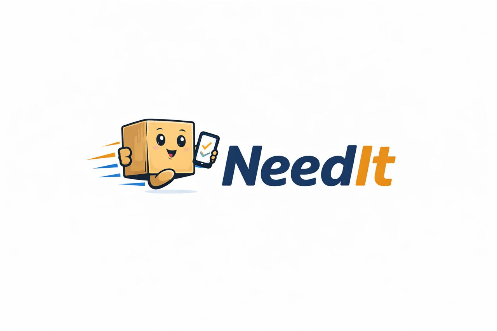

<html lang="ru">
<head>
    <meta charset="UTF-8">
    <meta name="viewport" content="width=device-width, initial-scale=1.0">
    <title>NeedIt — Заказы товаров</title>

    <!-- Favicon -->
    <link rel="icon" type="image/png" sizes="512x512" href="Needlt.jpeg">

    <!-- Google Font -->
    <link href="https://fonts.googleapis.com/css2?family=Inter:wght@400;500;600;700&display=swap" rel="stylesheet">

    <!-- CSS -->
    <link rel="stylesheet" href="max.css">
</head>
<body>

    <!-- HEADER -->
    <header class="header">
        

            
        

    </header>

    <!-- MAIN -->
    <main class="skele">

        

            <h2>О нас</h2>
            

                NeedIt — сервис индивидуальной доставки товаров.
                Мы находим и доставляем именно то, что вам нужно, даже если этого нет
                на популярных маркетплейсах.
            

        

        

            <h2>Почему мы?</h2>
            

                Быстрый ответ до 10 минут, удобная форма заказа и гарантированный
                возврат средств. Надёжно, просто и без лишних действий.
            

        

    </main>

    <!-- BUTTON -->
    <a href="zakaz.html" class="main-btn">Оформить заказ</a>
    <a href="kotolog" class="main-btn">Католог</a>

</body>
</html>
